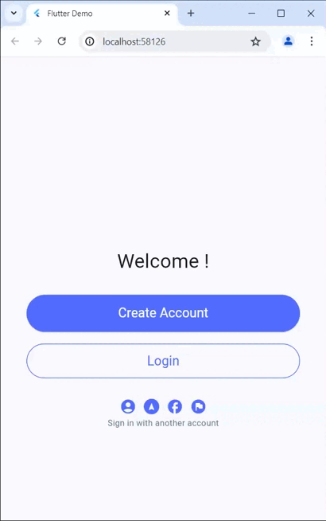

# Sample Design

در این پروژه پیاده سازی طرح زیر انجام شده است. می توانید از کد این پروژه به عنوان نقطه شروع پروژه خود استفاده کنید.

خروجی پروژه بالا با در نظر نگرفتن تصویر پس زمینه به صورت زیر است

## Getting Started
ابتدا از نصب صحیح فلاتر با اجرای دستور زیر مظمئن شوید. 

`flutter --verison`

پس از آن میتوانید کد را اجرا کنید و مشابه ویدئوی بالا نتیجه را در کروم مشاهده کنید.

در این پروژه ویجت ها در ساده ترین حالت ممکن و با توجه به مطالبی که در کلاس عنوان شد طراحی شده اند. بدیهی است که با توجه به اصول صحیح کدنویسی نیاز به برخی تغییرات (ریفکتور) در کد است که از آنها صرفنظر می کنیم. ضمنا کامنت هایی در کد درج شده است که مشخص می کند هر بخش از کد مربوط به کدام بخش از طرح است.

برای ساده تر شدن پیاده سازی پروژه موارد زیر را درنظر بگیرید:
- در طرح هایی که یک صفحه با ضربدر قرمز مشخص شده است یعنی نیازی به پیاده سازی آن صفحه نیست
- سایه ها، گردینت، تصاویر و بگراندها را در نظر نگیرید. در صورت نیاز بگراند تک رنگ و ساده را مطابق آموزش ها لحاظ کنید
- آیکن ها را مشابه این پروژه نمونه در نظر بگیرید. نیازی به پیاده سازی حاشیه و بگراند (مشابه آنچه در برخی طرح ها دیده میشود) برای آیکن ها نیست.
- اگر دکمه ها در طرح شما دارای آیکن یا تصویر هستند می توانید از آن صرفنظر کنید
- از بین دکمه هایی که در طرح شما وجود دارد تنها دکمه لاگین در صفحه اول عملکرد دارد و کاربر را به صفحه دوم از اپ هدایت می کند

با توجه به ساده سازی هایی که انجام شد حداقل نیازمندی برای دریافت نمره پروژه شامل این موارد است:
- پروژه شما باید (با در نظر گرفتن موارد بالا)، مشابه طرحی باشد که برای شما مشخص شده است. به این ترتیب بعد از این تاریخ (26 خرداد) امکان تغییر طرح پروژه وجود ندارد
- پروژه در هنگام تحویل باید قابل اجرا روی مرورگر باشد.
- توانایی تغییر کد برای مثال تغییر رنگ، متن و چیدمان عناصر پروژه خود را داشته باشید
- توانایی توضیح نحوه چیدمان عناصر (چگونگی استفاده از سطر و ستون برای چیدمان آیتم های ویو) در پروژه خود را داشته باشید
